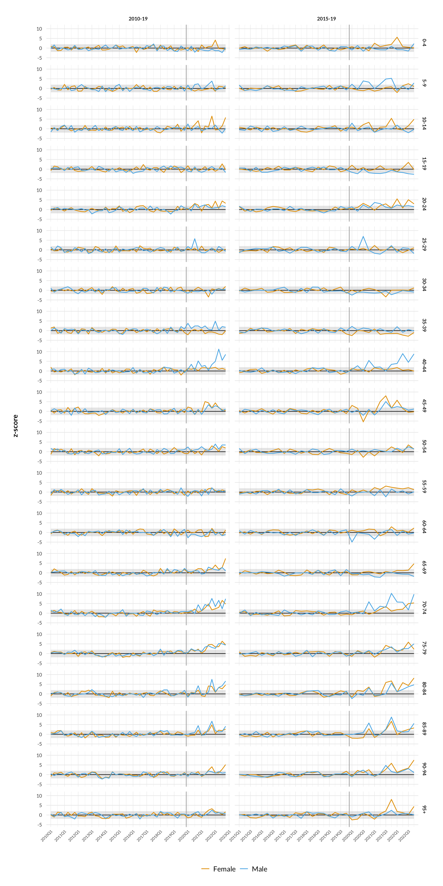

Quarterly death rates in Denmark by age and sex, 2020-2022 (*work in
progress*)
================
Kristoffer T. Bæk

## Summary

I calculated age and sex stratified death rates for each quarter during
the Covid-19 pandemic in Denmark (2020 Q1 to, so far, 2022 Q3) and
compared them to different pre-pandemic baselines. The baselines were
established by linear regression followed by adjustment for seasonality.
This analysis therefore takes into account both long-term trends, age
composition, and seasonality. Excess deaths were defined as deaths
exceeding a 95% prediction interval around the season adjusted
baselines. Using this method, I found 81 and 62 excess deaths per
100,000 (\~4800 and \~3700 excess deaths, respectively) from 2020 Q1 to
2022 Q3 using the 2010-2019 and 2015-2019 baseline, respectively.
Finally, I explored how sensitive the result is to choice of baseline
(using 2008-19, 2009-19, 2010-19, 2011-19, 2012-19, 2013-19, 2014-19,
2015-19, and 2016-19 as reference periods) and choice of data
stratification (varying age bin size and sex stratification), testing 45
combinations in total.

## Methods

### Data

Quarterly age-stratified [population
data](https://www.statistikbanken.dk/FOLK1A) and daily age-stratified
[death data](https://www.statistikbanken.dk/DODC1) were downloaded from
[Danmarks Statistik](https://www.dst.dk/en/) on 23 Nov 2022. The daily
death counts were summed by quarter for each stratification group.

### Death rates

The death rate for a given population group in a given quarter is here
defined as the number of deaths during the quarter divided by the
population size at the start of the quarter.

### Baselines

Baselines were established in two steps. First, I used linear regression
on quarterly death rates for a given reference period (e.g. 2010-2019)
to establish linear baselines. Then, season adjusted baselines were
calculated using the relative deviations (*RD*) from the linear
baselines with the formulas below. Basically, I calculated the mean
relative deviation, MRD, from the linear baseline for each quarter-type,
*Q* (1, 2, 3, or 4) for the reference years (*i*), and calculated the
season adjusted baseline, *baseline<sub>s</sub>*, as the linear baseline
value plus the product of MRD and the linear baseline value.

The 95% prediction interval *PI* was calculated as the season adjusted
baseline value +/- 1.96 times the relative standard deviation for each
quarter-type *Q* multiplied by the linear baseline value.


} = baseline_{i,Q} \times (1 + MRD_{Q})")

^2}")

} \pm baseline_{i,Q} \times 1.96 \times {SD_Q} ")

### Excess deaths

Excess death rates were defined as death rates exceeding the season
adjusted baseline +/- the prediction interval.

### Main code

All data manipulations and calculations were performed in R.

``` r
make_death_rates <- function(deaths_df, pop_df, ...) {
  #' Function that calculates death rates
  #' @param deaths_df Data frame with death numbers
  #' @param pop_df Data frame with population numbers
  #' @param ... Stratification variables
  #' @return Data frame 
  pop_df %<>%
    # summarize by quarter and strata
    group_by(..., Year, Quarter) %>%
    summarize(Population = sum(Population, na.rm = TRUE))
  
  deaths_df %>%
    mutate(
      Year = as.integer(lubridate::year(Date)),
      Quarter = lubridate::quarter(Date),
      YQ = zoo::as.yearqtr(format(paste0(Year, Quarter)), "%Y%q")
    ) %>%
    # summarize by quarter and strata
    group_by(..., Year, Quarter, YQ) %>%
    summarize(Deaths = sum(Deaths, na.rm = TRUE)) %>%
    # calculate death rates
    right_join(pop_df, by = c(purrr::map_chr(enquos(...), rlang::as_label), "Year", "Quarter")) %>%
    filter(YQ != "2022 Q4") %>% # excluding current incomplete quarter
    mutate(Death_rate = Deaths / Population) %>%
    ungroup()
}

make_base_df <- function(df, from, to, ...) {
  #' Helper function that makes nested data frame with death rates for the baseline period
  #' @param df Data frame with death rates
  #' @param from Baseline period start year
  #' @param to Baseline period end year
  #' @param ... Stratification variables
  #' @return Nested data frame
  df %>%
    select(..., Year, YQ, Quarter, Death_rate) %>%
    mutate(YQ = zoo::as.yearqtr(YQ)) %>% 
    filter(
      Year >= from,
      Year <= to
    ) %>%
    nest(base_data = -c(...))
}

calc_quart_stats <- function(df, z_value) {
  #' Helper function that calculates mean, SD, and prediction intervals 
  #' relative to baseline by quarter-type (1,2,3 or 4)
  #' @param df Data frame with death rates and fitted baseline for baseline period
  #' @param z_value z value used for the prediction interval
  #' @return Data frame
  df %>%
    group_by(Quarter) %>%
    summarize(
      mean_Q = mean(.resid / .fitted),
      sd_Q = sd(.resid / .fitted),
      conf_lo_Q = mean_Q - z_value * sd_Q,
      conf_hi_Q = mean_Q + z_value * sd_Q
    )
}

calc_excess <- function(df1, df2) {
  #' Helper function that calculates season adjusted baselines, excess deaths 
  #' and excess death rates
  #' @param df1 Data frame with outputs from calc_quart_stats()
  #' @param df2 Data frame with death rates and fitted baseline for all years
  #' @return Data frame
  df2 %>%
    left_join(df1, by = c("Quarter")) %>%
    # use the relative mean deviation and sd calculated for each quarter type to
    # calculate quarter adjusted fit and prediction interval
    mutate(
      fit = .fitted + mean_Q * .fitted,
      sd = sd_Q * .fitted,
      conf_lo = .fitted + .fitted * conf_lo_Q,
      conf_hi = .fitted + .fitted * conf_hi_Q,
      z = (Death_rate - fit) / sd,
      # calculate excess death rate as death rates exceeding quarterly adjusted fit +/- pred interval
      excess_rate = case_when(
        Death_rate > conf_hi ~ Death_rate - conf_hi,
        Death_rate < conf_lo ~ Death_rate - conf_lo,
        TRUE ~ 0
      ),
      # calculate excess death rate as death rates exceeding either the
      # quarterly adjusted or the linear fit
      excess_rate_sab = Death_rate - fit,
      excess_rate_lb = Death_rate - .fitted,
      # calculate excess deaths as above, but multiplying the rates by population
      excess_abs = excess_rate * Population,
      excess_abs_sab = excess_rate_sab * Population,
      excess_abs_lb = excess_rate_lb * Population
    ) %>%
    select(fit, sd, conf_lo, conf_hi, z, excess_rate, excess_rate_sab, excess_rate_lb, 
           excess_abs, excess_abs_sab, excess_abs_lb)
}

make_prediction <- function(df, pred, from, to, z_value, ...) {
  #' Function that calculates baselines and excess deaths
  #' @param df Data frame with death rates
  #' @param pred String with name for the baseline
  #' @param from Baseline period start year
  #' @param to Baseline period end year
  #' @param z_value z value used for the prediction interval
  #' @param ... Stratification variables
  #' @return Nested data frame
  df %>%
    select(..., Year, YQ, Quarter, Population, Death_rate) %>%
    mutate(prediction = pred, YQ = zoo::as.yearqtr(YQ)) %>%
    nest(all_data = -c(prediction, ...)) %>% # "all_data" is all data points from 2008-now
    full_join(make_base_df(df, from, to, ...), by = purrr::map_chr(enquos(...), rlang::as_label)) %>%
    mutate(
      # linear regression (= model)
      model = purrr::map(base_data, ~ lm(Death_rate ~ YQ, data = .x)),
      # fit and residuals on all data
      predict = purrr::map2(model, all_data, ~ broom::augment(.x, newdata = .y)),
      # fit and residuals on baseline data only
      predict_base = purrr::map2(model, base_data, ~ broom::augment(.x, newdata = .y)),
      # quarterly SDs and means
      qstats = purrr::map(predict_base, ~ calc_quart_stats(.x, z_value)),
      # season adjusted baselines, CI and excess deaths
      excess = purrr::map2(qstats, predict, ~ calc_excess(.x, .y))
    )
}
```

## Results

### Death rates and linear baselines

I calculated death rates for each age and sex group using 10-year bins.
The death rate is here defined as the number of deaths for a given
quarter (Figure 1A and B) divided by the population size at the start of
the quarter (Figure 1C).


***Figure 1: Population size and number of deaths in each age group for
the each quarter from 2010 Q1 to 2022 Q3.** (A) Deaths shown with fixed
y-axis, (B) deaths shown with variable y-axes, and (C) population size.*

In order to calculate excess deaths-rates during the Covid-19 pandemic,
a baseline defining the normal death rate must be established against
which the death rates during 2020-22 is compared. I used two different
reference periods to establish baselines, a 10-year period from 2010 to
2019 and 5-year period from 2015 to 2019. To establish baselines, I used
linear regressions.

Figure 2 shows the quarterly death rates for each group from 2010-2022
Q3. For most age groups, the 2010-19 baseline describes the death-rate
trend very well. For the age group 70-79, however, it looks like the
decreasing trend from 2010 to 2019 may be flattening towards the end of
the period, highlighting the importance of baseline choice (as shown in
Figure 10 the choice for this age group has a large impact). For males
in age-groups 10-19 and 30-39, the two baselines differ greatly, which
may be caused by a combination of large variation and outliers skewing
the 2015-19 baselines. These groups, however, only contribute little to
the overall excess death rate.


***Figure 2: Death rates and linear baselines.** Quarterly death rates
(deaths per 1000 people) for each age and sex group from 2010 to 2022 Q3
(colored lines). The black lines indicate linear regressions, defining
two different baselines, based on the years 2010-19 (solid line) and
2015-19 (dashed line). The vertical gray line indicate the border
between the reference period and the period of interest (2020-22).*

### Taking seasonality into account

Deaths in Denmark follow a seasonal pattern, which is primarily caused
by seasonality in the death rates among the older age-groups (which
contributes the majority of deaths in the total population), whereas
deaths among the younger age groups do not exhibit significant
seasonality (Figure 3).


***Figure 3: Seasonal deviation from linear baselines (showed for
2010-19 reference period).** The colored lines show the relative (%)
deviation from the linear baseline for each year from 2010-19. Black
dots indicate the mean relative deviation for each quarter and vertical
lines indicate the standard deviation of the relative deviations. The
gray bands indicate the derived prediction intervals.*

To better interpret how much the death rates during the pandemic deviate
from the baselines, I established season adjusted baselines and a 95%
prediction interval (calculated as 1.96

standard deviation) based on the quartertype (1, 2, 3, or 4)-specific
mean deviation from the linear baseline and the variation around the
mean, respectively (shown for 2010-19 in Figure 3). The season adjusted
baseline thus reflects the expected seasonal variation around the linear
baseline, and the prediction interval reflects the expected residual
variation around the season adjusted baseline, both directly based on
the observed variation in the chosen reference period. Note, that I
assume the expected seasonal and residual variation to be proportional
to the linear baseline value within each stratification group. Figures 4
and 5 show the death rates for each age and sex group together with the
season adjusted baselines.


***Figure 4: Quarterly death rates and season adjusted baselines using
2010-19 as reference period.** Colored lines indicate the quarterly
death rates, black lines indicate the season adjusted baselines, and the
gray band indicate the 95% prediction interval. Sex is indicated on top,
age on the right.*


***Figure 5: Quarterly death rates and season adjusted baselines using
2015-19 as reference period.** Colored lines indicate the quarterly
death rates, black lines indicate the season adjusted baselines, and the
gray band indicate the 95% prediction interval. Sex is indicated on top,
age on the right.*

In the following figures (Figure 6 and 7), I show the difference between
the observed death rates and season adjusted baselines (here called
death
rates), in effect de-trending and de-seasonalizing the death rates and
baselines.


***Figure 6: De-trended/de-seasonalized quarterly death rates and
baselines.** (A) Baseline reference period 2010-19, and (B) baseline
reference period 2015-19. Colored lines indicate the quarterly death
rates, black lines indicate the baselines, and the gray bands indicate
the 95% prediction intervals. Sex is indicated on top, age on the
right.*


***Figure 7: De-trended/de-seasonalized quarterly death rates and
baselines for 2020-2022.** (A) Baseline reference period 2010-19, and
(B) baseline reference period 2015-19. Colored lines indicate the
quarterly death rates for males and females, black lines indicate the
baselines, and the transparent colored bands indicate the 95% prediction
intervals for males (blue) and females (yellow).*

### Summarizing excess deaths

Here, I define excess deaths as deaths that exceed the season adjusted
baseline +/- the prediction interval (thus excess deaths can be both a
positive and negative number) for a given group in a given quarter. It
should be kept in mind that the excess death rates resulting from this
method depends strongly on, among other things, how the prediction
interval is calculated. A broad interval will “normalize” all the
pre-pandemic variation, whereas a narrower interval will normalize some
(or none) of the pre-pandemic variation. The interval I have chosen
(95%, 1.96 times standard deviation) normalizes “most” of the observed
pre-pandemic variation (see Figure 6). This is a subjective choice that
depends on what one aims to measure.

Excess deaths are back-calculated from the excess death rates using the
age and sex stratified quarterly population numbers.

Figure 8 and 9 show quarterly excess deaths stratified on age and sex,
Figure 10 shows excess deaths for the whole period per age group, and
Figure 11 shows excess deaths per 100,000 of the entire population per
year.


***Figure 8: Excess deaths by age and quarter.** Excess deaths are
defined as deaths exceeding the season adjusted baseline +/- the 95%
prediction interval in a given quarter. Age groups 0-19 are ommitted.*


***Figure 9: Excess deaths by sex and quarter.** Excess deaths are
defined as deaths exceeding the season adjusted baseline +/- the 95%
prediction interval in a given quarter.*


***Figure 10: Excess deaths by sex and age.** Excess deaths are defined
as deaths exceeding the season adjusted baseline +/- the 95% prediction
interval in a given quarter. Total excess deaths over the period 2020
Q1 - 2022 Q3 are summed.*


***Figure 11: Excess deaths per 100,000 of the total Danish population
per year.** Excess deaths are defined as deaths exceeding the season
adjusted baseline +/- the 95% prediction interval for a given
stratification in a given quarter. \*) 2022 is calculated based on Q1,
Q2, and Q3 only. The population for each year is taken as the mean of
the population at the start of each quarter.*

### Sensitivity to baseline

To explore how sensitive the result is to choice of baseline, I have
calculated the total excess death rate using the above method for nine
different baselines based on different reference periods (Figure 12).


***Figure 12: Excess deaths for the period 2020 Q1 - 2022 Q3 depending
on baseline reference period.** Excess deaths are defined as deaths
exceeding the season adjusted baseline +/- the 95% prediction interval
in a given quarter. Baseline period is indicated on the x-axis. (A)
Excess deaths per 100,000 of the total Danish population, and (B) excess
deaths stratified by age.*

As shown in Figure 12, the choice of reference period for the baseline
has a significant impact on the number of excess deaths. Most of the
difference between baselines is due to the 70-79 age group, with the
exception of the low rate of excess deaths found using the 2014-19
baseline, which is mainly influenced by the 80-89 age group. Figure 13
shows the de-trended and de-seasonalized death rates and baselines for
these two age groups (only males are shown for illustration). The large
impact of the reference period on the excess deaths in the 70-79 age
group appears to be due to the deviation of the long-term trend from a
linear fit (as mentioned above), while the low number of excess deaths
in the 80-89 age group using the 2014-19 baseline is due to a high
mortality year (2013, mainly Q1) followed immediately by a low mortality
year (2014).


***Figure 13: De-trended/de-seasonalized death rates and baselines for
older age groups using different baseline reference periods.** Colored
lines indicate the quarterly death rates for males and females , black
lines indicate the baselines, and the transparent colored bands indicate
the 95% prediction intervals for males (blue) and females (yellow), and
the vertical gray line indicates the border between reference period and
pandemic period. Age group is indicated on the right.*

### Sensitivity to stratification

To explore how sensitive the result is to the choice of stratification,
I first used 5-year instead of 10-year age bins. The de-trended and
de-seasonalized death rates and baselines are shown in Figure 14 and 15.
The calculated excess deaths for this stratification are shown in Figure
16. The numbers are lower than the numbers found using 10-year bins.


***Figure 14: De-trended/de-seasonalized quarterly death rates and
baselines using 5-year age brackets.** (A) Baseline reference period
2010-19, and (B) baseline reference period 2015-19. Colored lines
indicate the quarterly death rates, black lines indicate the baselines,
and the gray bands indicate the 95% prediction intervals. Sex is
indicted on top, age on the right.*


***Figure 15: De-trended/de-seasonalized quarterly death rates and
baselines for 2020-2022 using 5-year age brackets.** (A) Baseline
reference period 2010-19, and (B) baseline reference period 2015-19.
Colored lines indicate the quarterly death rates for males and females ,
black lines indicate the baselines, and the transparent colored bands
indicate the 95% prediction intervals for males (blue) and females
(red).*

<!-- -->

***Figure 16: Excess deaths by age for the period 2020 Q1 - 2022 Q3
depending on baseline reference period using 5-year brackets.** Excess
deaths are defined as deaths exceeding the season adjusted baseline +/-
the 95% prediction interval in a given quarter. Baseline period is
indicated on the x-axis.*

Then, I tried other stratifications, namely 10- and 5-year age bins but
without stratifying for sex, and a completely non-stratified dataset.
The excess death rates for all baselines and stratifications are shown
in Figure 17. To check how much of the differences are explained by
calculating excess deaths as those exceeding an interval,

*Should be edited: I also calculated excess deaths compared to the mean
season adjusted baseline itself (Figure 18) and found a bit less impact
of stratification. So the impact of stratification can be explained both
by the prediction intervals and the baselines themselves*

 ***Figure 17: Excess
deaths per 100,000 of the total Danish population for the period 2020
Q1 - 2022 Q3 for stratified and non-stratified data depending on
baseline reference period.** Excess deaths are defined as deaths
exceeding the season adjusted baseline +/- the 95% prediction in a given
quarter. Baseline reference period is indicated on the x-axis.*

<!-- -->

***Figure 18: Excess deaths\* per 100,000 of the total Danish population
for the period 2020 Q1 - 2022 Q3 for stratified and non-stratified data
depending on baseline reference period.** \*)Excess deaths in this plot
are defined as the difference between deaths and the season adjusted
baseline. Baseline reference period is indicated on the x-axis.*

## Discussion and limitations

In this analysis, I have examined the mortality rates in Denmark during
the Covid-19 pandemic by quarter, age, and sex, and compared the rates
to pre-pandemic baseline rates using a very simple model. The simplicity
of the model allows for transparency into the choices that impact how
much excess mortality is observed during the pandemic. These choices
include choice of the reference period, choice of stratification, and
choice of threshold for normal variability. The sensitivity analysis is
specific for this method and this dataset. Other methods or datasets may
be more or less sensitive to e.g. baseline choice or stratification.

-   Excess deaths by quarter (or shorter intervals) may underestimate
    excess deaths over longer time periods. For example if the death
    rates for a group are above the baseline but within the prediction
    interval for the whole period of 2020-22, it will not count as
    excess death, but may still be unusual for a three-year period. One
    could instead compare deaths over a similar time span during the
    reference period.

-   …
