## Summary

In this analysis, I calculated age and sex stratified death rates (deaths per population size) for each quarter during the Covid-19 pandemic in Denmark (2020 Q1 to, so far, 2022 Q3) and compared them to pre-pandemic death rates using two different baselines. The baselines were established by linear regression followed by adjustment for seasonality. Excess deaths were defined as deaths exceeding a prediction interval (1.96 $\times$ standard deviation using the chosen baseline period) around the season adjusted baselines. This analysis therefore takes into account both long term trends, age composition, and seasonality. With this method, I find 81 and 62 excess deaths per 100,000 (~4800 and ~3700 excess deaths, respectively) from 2020 Q1 to 2022 Q3 using the 2010-19 and 2015-19 baseline, respectively. Finally, I explore how sensitive the result is to choice of baseline (using 2008-19, 2009-19, 2010-19, 2011-19, 2012-19, 2013-19, 2014-19, 2015-19, and 2016-19 baselines) and choice of data stratification (varying age bin size and sex stratification), testing 45 combinations in total. 

## Methods

### Data

Quarterly age-stratified [population data](https://www.statistikbanken.dk/FOLK1A) and daily age-stratified [death data](https://www.statistikbanken.dk/DODC1) were downloaded from [Danmarks Statistik](https://www.dst.dk/en/) on 23 Nov 2022. The daily death counts were summed by quarter for each stratification group. 

### Death rates

The death rate for a given population group in a given quarter is here defined as the number of deaths during the quarter divided by the population size at the start of the quarter.

### Baselines

Baselines were established in two steps. First, I used linear regression on quarterly death rates for a given baseline period (e.g. 2010-2019) to establish linear baselines. Then, season adjusted baselines were calculated using the formulas below. Basically, I calculated the mean relative deviation ($\overline {rd_Q}$) from the linear baseline for each quarter-type, $Q$ (1, 2, 3, or 4) for the baseline years ($i$), and calculated the season adjusted baseline, $baseline_{s}$, as the linear baseline value $+$ the product of $\overline {rd_Q}$ and the linear baseline value. 

The 95% prediction interval $PI$ was calculated as the season adjusted baseline value +/- 1.96 $\times$ the relative standard deviation for each quarter-type $Q$ multiplied by the linear baseline value. 

$$\overline {rd_Q} = \frac{1}{N}\sum_{i=1}^{N} \frac{residual_{i,Q}}{baseline_{i,Q}}$$
$$baseline_{s \space i,Q} = baseline_{i,Q} + baseline_{i,Q} \times \overline {rd_Q} $$
$$PI_{i,Q} = baseline_{s \space i,Q} \pm baseline_{i,Q} \times 1.96 \times {SD_Q} $$

### Excess deaths

Excess death rates were defined as death rates exceeding the season adjusted baseline +/- the prediction interval.


### Main code

All data manipulations and calculations were performed in R.

<div class="layout-chunk" data-layout="l-body">
<div class="sourceCode"><pre class="sourceCode r"><code class="sourceCode r"><span class='co'># Main functions ---------------------------------------------------------------</span>
<span class='va'>make_death_rates</span> <span class='op'>&lt;-</span> <span class='kw'>function</span><span class='op'>(</span><span class='va'>deaths_df</span>, <span class='va'>pop_df</span>, <span class='va'>...</span><span class='op'>)</span> <span class='op'>{</span>
  <span class='co'>#' Function that calculates death rates</span>
  <span class='co'>#' @param deaths_df Data frame with death numbers</span>
  <span class='co'>#' @param pop_df Data frame with population numbers</span>
  <span class='co'>#' @param ... Stratification variables</span>
  <span class='co'>#' @return Data frame </span>
  <span class='va'>pop_df</span> <span class='op'><a href='https://magrittr.tidyverse.org/reference/compound.html'>%&lt;&gt;%</a></span>
    <span class='co'># summarize by quarter and strata</span>
    <span class='fu'><a href='https://dplyr.tidyverse.org/reference/group_by.html'>group_by</a></span><span class='op'>(</span><span class='va'>...</span>, <span class='va'>Year</span>, <span class='va'>Quarter</span><span class='op'>)</span> <span class='op'><a href='https://magrittr.tidyverse.org/reference/pipe.html'>%&gt;%</a></span>
    <span class='fu'><a href='https://dplyr.tidyverse.org/reference/summarise.html'>summarize</a></span><span class='op'>(</span>Population <span class='op'>=</span> <span class='fu'><a href='https://rdrr.io/r/base/sum.html'>sum</a></span><span class='op'>(</span><span class='va'>Population</span>, na.rm <span class='op'>=</span> <span class='cn'>TRUE</span><span class='op'>)</span><span class='op'>)</span>

  <span class='va'>deaths_df</span> <span class='op'><a href='https://magrittr.tidyverse.org/reference/pipe.html'>%&gt;%</a></span>
    <span class='fu'><a href='https://dplyr.tidyverse.org/reference/mutate.html'>mutate</a></span><span class='op'>(</span>
      Year <span class='op'>=</span> <span class='fu'><a href='https://rdrr.io/r/base/integer.html'>as.integer</a></span><span class='op'>(</span><span class='fu'><a href='https://lubridate.tidyverse.org/reference/year.html'>year</a></span><span class='op'>(</span><span class='va'>Date</span><span class='op'>)</span><span class='op'>)</span>,
      Quarter <span class='op'>=</span> <span class='fu'><a href='https://lubridate.tidyverse.org/reference/quarter.html'>quarter</a></span><span class='op'>(</span><span class='va'>Date</span><span class='op'>)</span>,
      YQ <span class='op'>=</span> <span class='fu'>zoo</span><span class='fu'>::</span><span class='fu'><a href='https://rdrr.io/pkg/zoo/man/yearqtr.html'>as.yearqtr</a></span><span class='op'>(</span><span class='fu'><a href='https://rdrr.io/r/base/format.html'>format</a></span><span class='op'>(</span><span class='fu'><a href='https://rdrr.io/r/base/paste.html'>paste0</a></span><span class='op'>(</span><span class='va'>Year</span>, <span class='va'>Quarter</span><span class='op'>)</span><span class='op'>)</span>, <span class='st'>"%Y%q"</span><span class='op'>)</span>
    <span class='op'>)</span> <span class='op'><a href='https://magrittr.tidyverse.org/reference/pipe.html'>%&gt;%</a></span>
    <span class='co'># summarize by quarter and strata</span>
    <span class='fu'><a href='https://dplyr.tidyverse.org/reference/group_by.html'>group_by</a></span><span class='op'>(</span><span class='va'>...</span>, <span class='va'>Year</span>, <span class='va'>Quarter</span>, <span class='va'>YQ</span><span class='op'>)</span> <span class='op'><a href='https://magrittr.tidyverse.org/reference/pipe.html'>%&gt;%</a></span>
    <span class='fu'><a href='https://dplyr.tidyverse.org/reference/summarise.html'>summarize</a></span><span class='op'>(</span>Deaths <span class='op'>=</span> <span class='fu'><a href='https://rdrr.io/r/base/sum.html'>sum</a></span><span class='op'>(</span><span class='va'>Deaths</span>, na.rm <span class='op'>=</span> <span class='cn'>TRUE</span><span class='op'>)</span><span class='op'>)</span> <span class='op'><a href='https://magrittr.tidyverse.org/reference/pipe.html'>%&gt;%</a></span>
    <span class='co'># calculate death rates</span>
    <span class='fu'><a href='https://dplyr.tidyverse.org/reference/mutate-joins.html'>right_join</a></span><span class='op'>(</span><span class='va'>pop_df</span>, by <span class='op'>=</span> <span class='fu'><a href='https://rdrr.io/r/base/c.html'>c</a></span><span class='op'>(</span><span class='fu'>purrr</span><span class='fu'>::</span><span class='fu'><a href='https://purrr.tidyverse.org/reference/map.html'>map_chr</a></span><span class='op'>(</span><span class='fu'><a href='https://ggplot2.tidyverse.org/reference/tidyeval.html'>enquos</a></span><span class='op'>(</span><span class='va'>...</span><span class='op'>)</span>, <span class='fu'>rlang</span><span class='fu'>::</span><span class='va'><a href='https://rlang.r-lib.org/reference/as_label.html'>as_label</a></span><span class='op'>)</span>, <span class='st'>"Year"</span>, <span class='st'>"Quarter"</span><span class='op'>)</span><span class='op'>)</span> <span class='op'><a href='https://magrittr.tidyverse.org/reference/pipe.html'>%&gt;%</a></span>
    <span class='fu'><a href='https://dplyr.tidyverse.org/reference/filter.html'>filter</a></span><span class='op'>(</span><span class='va'>YQ</span> <span class='op'>!=</span> <span class='st'>"2022 Q4"</span><span class='op'>)</span> <span class='op'><a href='https://magrittr.tidyverse.org/reference/pipe.html'>%&gt;%</a></span> <span class='co'># excluding current incomplete quarter</span>
    <span class='fu'><a href='https://dplyr.tidyverse.org/reference/mutate.html'>mutate</a></span><span class='op'>(</span>Death_rate <span class='op'>=</span> <span class='va'>Deaths</span> <span class='op'>/</span> <span class='va'>Population</span><span class='op'>)</span> <span class='op'><a href='https://magrittr.tidyverse.org/reference/pipe.html'>%&gt;%</a></span>
    <span class='fu'><a href='https://dplyr.tidyverse.org/reference/group_by.html'>ungroup</a></span><span class='op'>(</span><span class='op'>)</span>
<span class='op'>}</span>

<span class='va'>make_base_df</span> <span class='op'>&lt;-</span> <span class='kw'>function</span><span class='op'>(</span><span class='va'>df</span>, <span class='va'>from</span>, <span class='va'>to</span>, <span class='va'>...</span><span class='op'>)</span> <span class='op'>{</span>
  <span class='co'>#' Helper function that makes nested data frame with death rates for the baseline period</span>
  <span class='co'>#' @param df Data frame with death rates</span>
  <span class='co'>#' @param from Baseline period start year</span>
  <span class='co'>#' @param to Baseline period end year</span>
  <span class='co'>#' @param ... Stratification variables</span>
  <span class='co'>#' @return Nested data frame</span>
  <span class='va'>df</span> <span class='op'><a href='https://magrittr.tidyverse.org/reference/pipe.html'>%&gt;%</a></span>
    <span class='fu'><a href='https://dplyr.tidyverse.org/reference/select.html'>select</a></span><span class='op'>(</span><span class='va'>...</span>, <span class='va'>Year</span>, <span class='va'>YQ</span>, <span class='va'>Quarter</span>, <span class='va'>Death_rate</span><span class='op'>)</span> <span class='op'><a href='https://magrittr.tidyverse.org/reference/pipe.html'>%&gt;%</a></span>
    <span class='fu'><a href='https://dplyr.tidyverse.org/reference/filter.html'>filter</a></span><span class='op'>(</span>
      <span class='va'>Year</span> <span class='op'>&gt;=</span> <span class='va'>from</span>,
      <span class='va'>Year</span> <span class='op'>&lt;=</span> <span class='va'>to</span>
    <span class='op'>)</span> <span class='op'><a href='https://magrittr.tidyverse.org/reference/pipe.html'>%&gt;%</a></span>
    <span class='fu'><a href='https://tidyr.tidyverse.org/reference/nest.html'>nest</a></span><span class='op'>(</span>base_data <span class='op'>=</span> <span class='op'>-</span><span class='fu'><a href='https://rdrr.io/r/base/c.html'>c</a></span><span class='op'>(</span><span class='va'>...</span><span class='op'>)</span><span class='op'>)</span>
<span class='op'>}</span>

<span class='va'>calc_quart_stats</span> <span class='op'>&lt;-</span> <span class='kw'>function</span><span class='op'>(</span><span class='va'>df</span><span class='op'>)</span> <span class='op'>{</span>
  <span class='co'>#' Helper function that calculates mean, SD, and prediction intervals </span>
  <span class='co'>#' relative to baseline by quarter-type (1,2,3 or 4)</span>
  <span class='co'>#' @param df Data frame with death rates and fitted baseline for baseline period</span>
  <span class='co'>#' @return Data frame</span>
  <span class='va'>df</span> <span class='op'><a href='https://magrittr.tidyverse.org/reference/pipe.html'>%&gt;%</a></span>
    <span class='fu'><a href='https://dplyr.tidyverse.org/reference/group_by.html'>group_by</a></span><span class='op'>(</span><span class='va'>Quarter</span><span class='op'>)</span> <span class='op'><a href='https://magrittr.tidyverse.org/reference/pipe.html'>%&gt;%</a></span>
    <span class='fu'><a href='https://dplyr.tidyverse.org/reference/summarise.html'>summarize</a></span><span class='op'>(</span>
      mean_Q <span class='op'>=</span> <span class='fu'><a href='https://rdrr.io/r/base/mean.html'>mean</a></span><span class='op'>(</span><span class='va'>.resid</span> <span class='op'>/</span> <span class='va'>.fitted</span><span class='op'>)</span>,
      sd_Q <span class='op'>=</span> <span class='fu'><a href='https://rdrr.io/r/stats/sd.html'>sd</a></span><span class='op'>(</span><span class='va'>.resid</span> <span class='op'>/</span> <span class='va'>.fitted</span><span class='op'>)</span>,
      conf_lo_Q <span class='op'>=</span> <span class='va'>mean_Q</span> <span class='op'>-</span> <span class='fl'>1.96</span> <span class='op'>*</span> <span class='va'>sd_Q</span>,
      conf_hi_Q <span class='op'>=</span> <span class='va'>mean_Q</span> <span class='op'>+</span> <span class='fl'>1.96</span> <span class='op'>*</span> <span class='va'>sd_Q</span>
    <span class='op'>)</span>
<span class='op'>}</span>

<span class='va'>calc_excess</span> <span class='op'>&lt;-</span> <span class='kw'>function</span><span class='op'>(</span><span class='va'>df1</span>, <span class='va'>df2</span><span class='op'>)</span> <span class='op'>{</span>
  <span class='co'>#' Helper function that calculates season adjusted baselines, excess deaths </span>
  <span class='co'>#' and excess death rates</span>
  <span class='co'>#' @param df1 Data frame with outputs from calc_quart_stats()</span>
  <span class='co'>#' @param df2 Data frame with death rates and fitted baseline for all years</span>
  <span class='co'>#' @return Data frame</span>
  <span class='va'>df2</span> <span class='op'><a href='https://magrittr.tidyverse.org/reference/pipe.html'>%&gt;%</a></span>
    <span class='fu'><a href='https://dplyr.tidyverse.org/reference/mutate-joins.html'>left_join</a></span><span class='op'>(</span><span class='va'>df1</span>, by <span class='op'>=</span> <span class='fu'><a href='https://rdrr.io/r/base/c.html'>c</a></span><span class='op'>(</span><span class='st'>"Quarter"</span><span class='op'>)</span><span class='op'>)</span> <span class='op'><a href='https://magrittr.tidyverse.org/reference/pipe.html'>%&gt;%</a></span>
    <span class='co'># use the relative mean deviation and sd calculated for each quarter type to</span>
    <span class='co'># calculate quarter adjusted fit and prediction interval</span>
    <span class='fu'><a href='https://dplyr.tidyverse.org/reference/mutate.html'>mutate</a></span><span class='op'>(</span>
      fit <span class='op'>=</span> <span class='va'>.fitted</span> <span class='op'>+</span> <span class='va'>mean_Q</span> <span class='op'>*</span> <span class='va'>.fitted</span>,
      sd <span class='op'>=</span> <span class='va'>sd_Q</span> <span class='op'>*</span> <span class='va'>.fitted</span>,
      conf_lo <span class='op'>=</span> <span class='va'>.fitted</span> <span class='op'>+</span> <span class='va'>.fitted</span> <span class='op'>*</span> <span class='va'>conf_lo_Q</span>,
      conf_hi <span class='op'>=</span> <span class='va'>.fitted</span> <span class='op'>+</span> <span class='va'>.fitted</span> <span class='op'>*</span> <span class='va'>conf_hi_Q</span>,
      z <span class='op'>=</span> <span class='op'>(</span><span class='va'>Death_rate</span> <span class='op'>-</span> <span class='va'>fit</span><span class='op'>)</span> <span class='op'>/</span> <span class='va'>sd</span>,
      <span class='co'># calculate excess death rate as death rates exceeding quarterly adjusted fit +/- pred interval</span>
      excess_rate <span class='op'>=</span> <span class='fu'><a href='https://dplyr.tidyverse.org/reference/case_when.html'>case_when</a></span><span class='op'>(</span>
        <span class='va'>Death_rate</span> <span class='op'>&gt;</span> <span class='va'>conf_hi</span> <span class='op'>~</span> <span class='va'>Death_rate</span> <span class='op'>-</span> <span class='va'>conf_hi</span>,
        <span class='va'>Death_rate</span> <span class='op'>&lt;</span> <span class='va'>conf_lo</span> <span class='op'>~</span> <span class='va'>Death_rate</span> <span class='op'>-</span> <span class='va'>conf_lo</span>,
        <span class='cn'>TRUE</span> <span class='op'>~</span> <span class='fl'>0</span>
      <span class='op'>)</span>,
      <span class='co'># calculate excess death rate as death rates exceeding either the</span>
      <span class='co'># quarterly adjusted or the linear fit</span>
      excess_rate_sab <span class='op'>=</span> <span class='va'>Death_rate</span> <span class='op'>-</span> <span class='va'>fit</span>,
      excess_rate_lb <span class='op'>=</span> <span class='va'>Death_rate</span> <span class='op'>-</span> <span class='va'>.fitted</span>,
      <span class='co'># calculate excess deaths as above, but multiplying the rates by population</span>
      excess_abs <span class='op'>=</span> <span class='va'>excess_rate</span> <span class='op'>*</span> <span class='va'>Population</span>,
      excess_abs_sab <span class='op'>=</span> <span class='va'>excess_rate_sab</span> <span class='op'>*</span> <span class='va'>Population</span>,
      excess_abs_lb <span class='op'>=</span> <span class='va'>excess_rate_lb</span> <span class='op'>*</span> <span class='va'>Population</span>
    <span class='op'>)</span> <span class='op'><a href='https://magrittr.tidyverse.org/reference/pipe.html'>%&gt;%</a></span>
    <span class='fu'><a href='https://dplyr.tidyverse.org/reference/select.html'>select</a></span><span class='op'>(</span><span class='va'>fit</span>, <span class='va'>sd</span>, <span class='va'>conf_lo</span>, <span class='va'>conf_hi</span>, <span class='va'>z</span>, <span class='va'>excess_rate</span>, <span class='va'>excess_rate_sab</span>, <span class='va'>excess_rate_lb</span>, 
           <span class='va'>excess_abs</span>, <span class='va'>excess_abs_sab</span>, <span class='va'>excess_abs_lb</span><span class='op'>)</span>
<span class='op'>}</span>

<span class='va'>make_prediction</span> <span class='op'>&lt;-</span> <span class='kw'>function</span><span class='op'>(</span><span class='va'>df</span>, <span class='va'>pred</span>, <span class='va'>from</span>, <span class='va'>to</span>, <span class='va'>...</span><span class='op'>)</span> <span class='op'>{</span>
  <span class='co'>#' Function that calculates baselines and excess deaths</span>
  <span class='co'>#' @param df Data frame with death rates</span>
  <span class='co'>#' @param pred String with name for the baseline</span>
  <span class='co'>#' @param from Baseline period start year</span>
  <span class='co'>#' @param to Baseline period end year</span>
  <span class='co'>#' @param ... Stratification variables</span>
  <span class='co'>#' @return Nested data frame</span>
  <span class='va'>df</span> <span class='op'><a href='https://magrittr.tidyverse.org/reference/pipe.html'>%&gt;%</a></span>
    <span class='fu'><a href='https://dplyr.tidyverse.org/reference/select.html'>select</a></span><span class='op'>(</span><span class='va'>...</span>, <span class='va'>Year</span>, <span class='va'>YQ</span>, <span class='va'>Quarter</span>, <span class='va'>Population</span>, <span class='va'>Death_rate</span><span class='op'>)</span> <span class='op'><a href='https://magrittr.tidyverse.org/reference/pipe.html'>%&gt;%</a></span>
    <span class='fu'><a href='https://dplyr.tidyverse.org/reference/mutate.html'>mutate</a></span><span class='op'>(</span>prediction <span class='op'>=</span> <span class='va'>pred</span><span class='op'>)</span> <span class='op'><a href='https://magrittr.tidyverse.org/reference/pipe.html'>%&gt;%</a></span>
    <span class='fu'><a href='https://tidyr.tidyverse.org/reference/nest.html'>nest</a></span><span class='op'>(</span>all_data <span class='op'>=</span> <span class='op'>-</span><span class='fu'><a href='https://rdrr.io/r/base/c.html'>c</a></span><span class='op'>(</span><span class='va'>prediction</span>, <span class='va'>...</span><span class='op'>)</span><span class='op'>)</span> <span class='op'><a href='https://magrittr.tidyverse.org/reference/pipe.html'>%&gt;%</a></span> <span class='co'># "all_data" is all data points from 2010-now</span>
    <span class='fu'><a href='https://dplyr.tidyverse.org/reference/mutate-joins.html'>full_join</a></span><span class='op'>(</span><span class='fu'>make_base_df</span><span class='op'>(</span><span class='va'>df</span>, <span class='va'>from</span>, <span class='va'>to</span>, <span class='va'>...</span><span class='op'>)</span>, by <span class='op'>=</span> <span class='fu'>purrr</span><span class='fu'>::</span><span class='fu'><a href='https://purrr.tidyverse.org/reference/map.html'>map_chr</a></span><span class='op'>(</span><span class='fu'><a href='https://ggplot2.tidyverse.org/reference/tidyeval.html'>enquos</a></span><span class='op'>(</span><span class='va'>...</span><span class='op'>)</span>, <span class='fu'>rlang</span><span class='fu'>::</span><span class='va'><a href='https://rlang.r-lib.org/reference/as_label.html'>as_label</a></span><span class='op'>)</span><span class='op'>)</span> <span class='op'><a href='https://magrittr.tidyverse.org/reference/pipe.html'>%&gt;%</a></span>
    <span class='fu'><a href='https://dplyr.tidyverse.org/reference/mutate.html'>mutate</a></span><span class='op'>(</span>
      <span class='co'># linear regression (= model)</span>
      model <span class='op'>=</span> <span class='fu'>purrr</span><span class='fu'>::</span><span class='fu'><a href='https://purrr.tidyverse.org/reference/map.html'>map</a></span><span class='op'>(</span><span class='va'>base_data</span>, <span class='op'>~</span> <span class='fu'><a href='https://rdrr.io/r/stats/lm.html'>lm</a></span><span class='op'>(</span><span class='va'>Death_rate</span> <span class='op'>~</span> <span class='va'>YQ</span>, data <span class='op'>=</span> <span class='va'>.x</span><span class='op'>)</span><span class='op'>)</span>,
      <span class='co'># fit and residuals on all data</span>
      predict <span class='op'>=</span> <span class='fu'>purrr</span><span class='fu'>::</span><span class='fu'><a href='https://purrr.tidyverse.org/reference/map2.html'>map2</a></span><span class='op'>(</span><span class='va'>model</span>, <span class='va'>all_data</span>, <span class='op'>~</span> <span class='fu'>broom</span><span class='fu'>::</span><span class='fu'><a href='https://generics.r-lib.org/reference/augment.html'>augment</a></span><span class='op'>(</span><span class='va'>.x</span>, newdata <span class='op'>=</span> <span class='va'>.y</span><span class='op'>)</span><span class='op'>)</span>,
      <span class='co'># fit and residuals on baseline data only</span>
      predict_base <span class='op'>=</span> <span class='fu'>purrr</span><span class='fu'>::</span><span class='fu'><a href='https://purrr.tidyverse.org/reference/map2.html'>map2</a></span><span class='op'>(</span><span class='va'>model</span>, <span class='va'>base_data</span>, <span class='op'>~</span> <span class='fu'>broom</span><span class='fu'>::</span><span class='fu'><a href='https://generics.r-lib.org/reference/augment.html'>augment</a></span><span class='op'>(</span><span class='va'>.x</span>, newdata <span class='op'>=</span> <span class='va'>.y</span><span class='op'>)</span><span class='op'>)</span>,
      <span class='co'># quarterly SDs and means</span>
      qstats <span class='op'>=</span> <span class='fu'>purrr</span><span class='fu'>::</span><span class='fu'><a href='https://purrr.tidyverse.org/reference/map.html'>map</a></span><span class='op'>(</span><span class='va'>predict_base</span>, <span class='op'>~</span> <span class='fu'>calc_quart_stats</span><span class='op'>(</span><span class='va'>.x</span><span class='op'>)</span><span class='op'>)</span>,
      <span class='co'># season adjusted baselines, CI and excess deaths</span>
      excess <span class='op'>=</span> <span class='fu'>purrr</span><span class='fu'>::</span><span class='fu'><a href='https://purrr.tidyverse.org/reference/map2.html'>map2</a></span><span class='op'>(</span><span class='va'>qstats</span>, <span class='va'>predict</span>, <span class='op'>~</span> <span class='fu'>calc_excess</span><span class='op'>(</span><span class='va'>.x</span>, <span class='va'>.y</span><span class='op'>)</span><span class='op'>)</span>
    <span class='op'>)</span>
<span class='op'>}</span>
</code></pre></div>

</div>


## Results

### Death rates and linear baselines
<div class="layout-chunk" data-layout="l-body">


</div>


<div class="layout-chunk" data-layout="l-body">


</div>


I calculated death rates for each age and sex group using 10-year bins. The death rate is here defined as the number of deaths for a given quarter (Figure \@ref(fig:deaths-population)A and B) divided by the population size at the start of the quarter (Figure \@ref(fig:deaths-population)C). 

<div class="layout-chunk" data-layout="l-page">
<div class="figure">
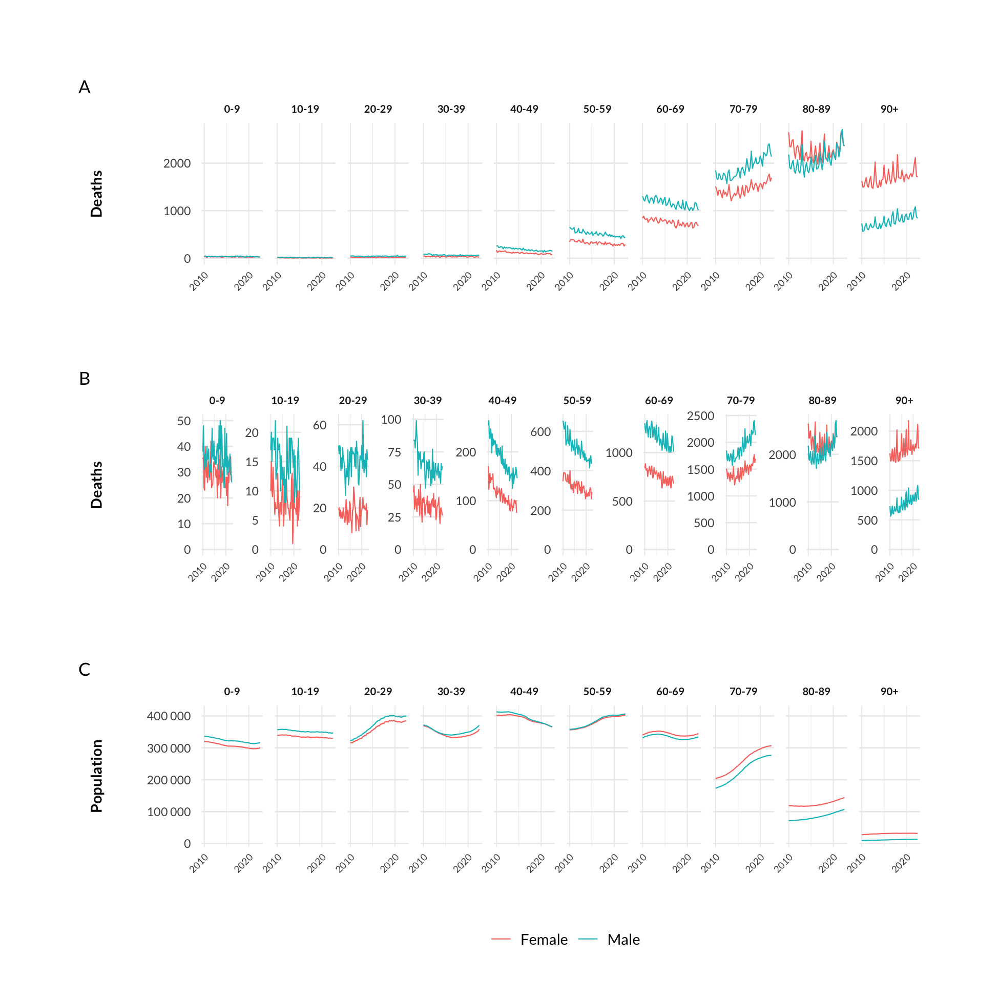
<p class="caption">(\#fig:deaths-population)**Population size and number of deaths in each age group for the each quarter from 2010 Q1 to 2022 Q3.** (A) Deaths shown with fixed y-axis, (B) deaths shown with variable y-axes, and (C) population size.</p>
</div>

</div>


In order to calculate excess deaths-rates during the Covid-19 pandemic, a baseline defining the normal death rate must be established against which the death rates during 2020-22 is compared. I used two different time periods to establish baselines, a 10-year period from 2010-2019 and 5-year period from 2015-19. To establish baselines, I used linear regressions. 

Figure \@ref(fig:linear-baselines-10y-sex) shows the quarterly death rates for each group from 2010-2022 Q3. First off, note the decreasing trend in death rates for the age groups 10-89, which is particularly striking for the middle age groups (40-59). For most age groups, the 2010-19 baseline describes the death-rate trend very well. For the age group 70-79, however, it looks like the decreasing trend from 2010 to 2019 may be flattening towards the end of the period, highlighting the importance of baseline choice (as shown in Figure \@ref(fig:excess-both-bases-age-sex) the choice for this age group has a large impact). For the males in the age-groups 10-19 and 30-39, the two baselines differ greatly, which may be caused by a combination of large variation and outliers skewing the 2015-19 baselines. These groups, however, only contribute little to the overall excess death rate.


<div class="layout-chunk" data-layout="l-page">
<div class="figure">
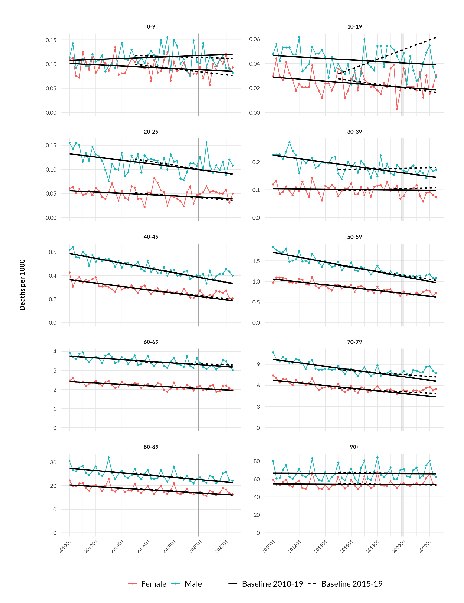
<p class="caption">(\#fig:linear-baselines-10y-sex)**Death rates and baselines.** Quarterly death rates (deaths per 1000 people) for each age and sex group from 2010 to 2022 Q3 (colored lines). The black lines indicate linear regressions, defining two different baselines, based on the years 2010-19 (solid line) and 2015-19 (dashed line). The vertical gray line indicate the border between the reference period and the period of interest (2020-22).</p>
</div>

</div>


### Taking seasonality into account

Deaths in Denmark follow a seasonal pattern, which is primarily caused by seasonality in the death rates among the older age-groups (which contributes the majority of deaths in the total population), whereas deaths among the younger age groups do not exhibit significant seasonality (Figure \@ref(fig:seasonality-10y-sex)). 

<div class="layout-chunk" data-layout="l-page">
<div class="figure">
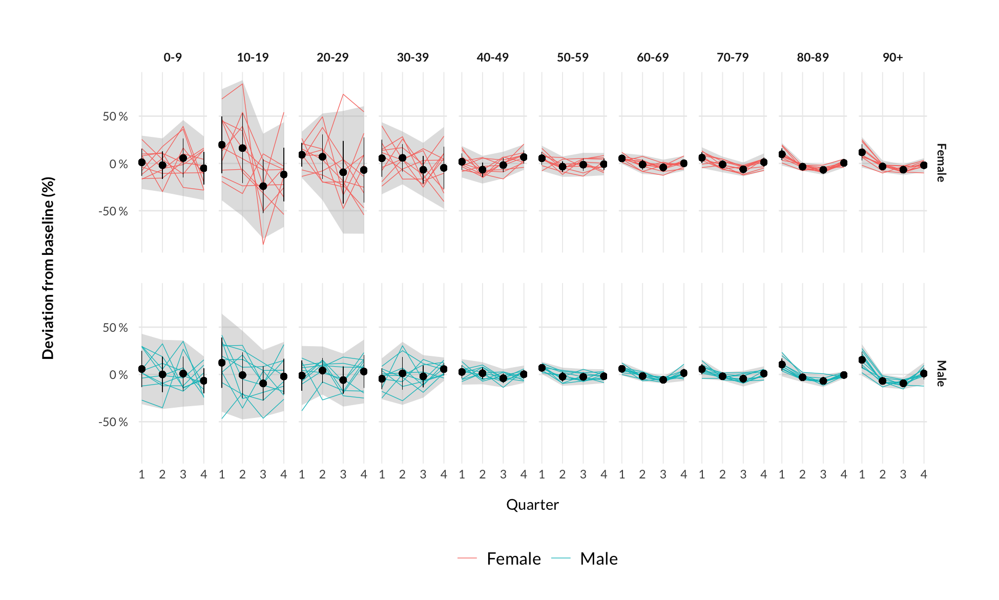
<p class="caption">(\#fig:seasonality-10y-sex)**Seasonal deviation from linear baselines (using the 2010-19 reference period).** The colored lines show the relative (%) deviation from the linear baseline for each year from 2010-19. Black dots indicate the mean relative deviation for each quarter and vertical lines indicate the standard deviation of the relative deviations. The gray bands indicate the derived prediction intervals.</p>
</div>

</div>


To better interpret how much the death rates during the pandemic deviate from the baselines, I established season adjusted baselines and a 95% prediction interval (calculated as 1.96 $\times$ standard deviation) based on the quarter-specific variation shown in Figure \@ref(fig:seasonality-10y-sex). The prediction interval thus reflects the expected variation around the season adjusted baseline based on the observed pre-pandemic variation. Note, that it is here assumed that the expected seasonal variation is proportional to the linear baseline value within each stratification group (the 40-49yo age group in Figure \@ref(fig:sab-10y-sex-norm) exemplifies this). Figures \@ref(fig:sab-10y-sex-base1) and \@ref(fig:sab-10y-sex-base2) show the death rates for each age and sex group together with the season adjusted baselines.

<div class="layout-chunk" data-layout="l-page">
<div class="figure">
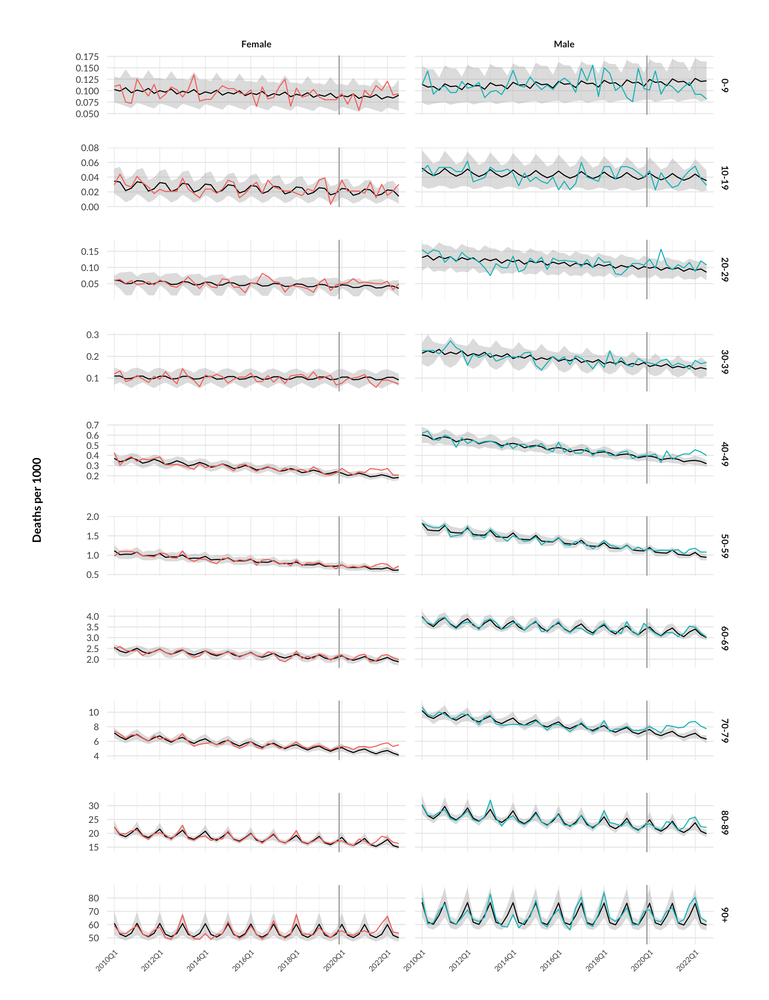
<p class="caption">(\#fig:sab-10y-sex-base1)**Quarterly death rates and season adjusted baselines using  2010-19 as reference period.** Colored lines indicate the quarterly death rates, black lines indicate the season adjusted baselines, and the gray band indicate the 95% prediction interval. Sex is indicated on top, age on the right.</p>
</div>

</div>


<div class="layout-chunk" data-layout="l-page">
<div class="figure">
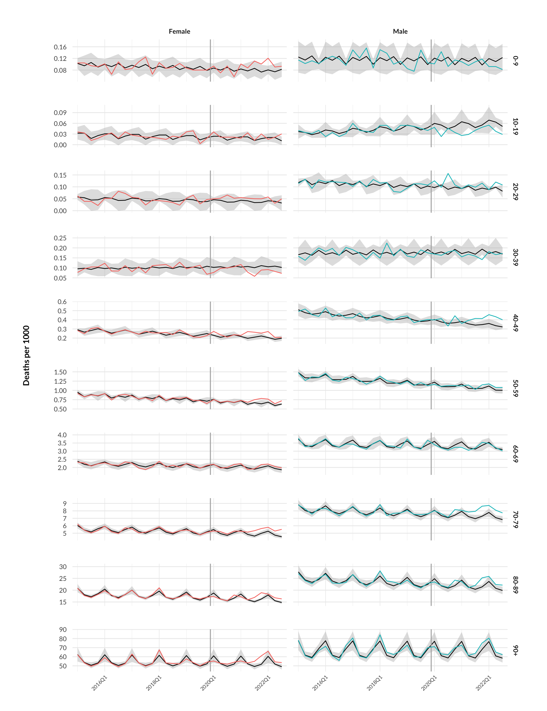
<p class="caption">(\#fig:sab-10y-sex-base2)**Quarterly death rates and season adjusted baselines using  2015-19 as reference period.** Colored lines indicate the quarterly death rates, black lines indicate the season adjusted baselines, and the gray band indicate the 95% prediction interval. Sex is indicated on top, age on the right.</p>
</div>

</div>


In the following figures (Figure \@ref(fig:sab-10y-sex-norm) and \@ref(fig:sab-10y-sex-norm-covid)), I show the difference between the observed death rates and the expected season adjusted death rates ($\Delta$death rates), effectively de-trending and de-seasonalizing the death rates and baselines.

<div class="layout-chunk" data-layout="l-page">
<div class="figure">
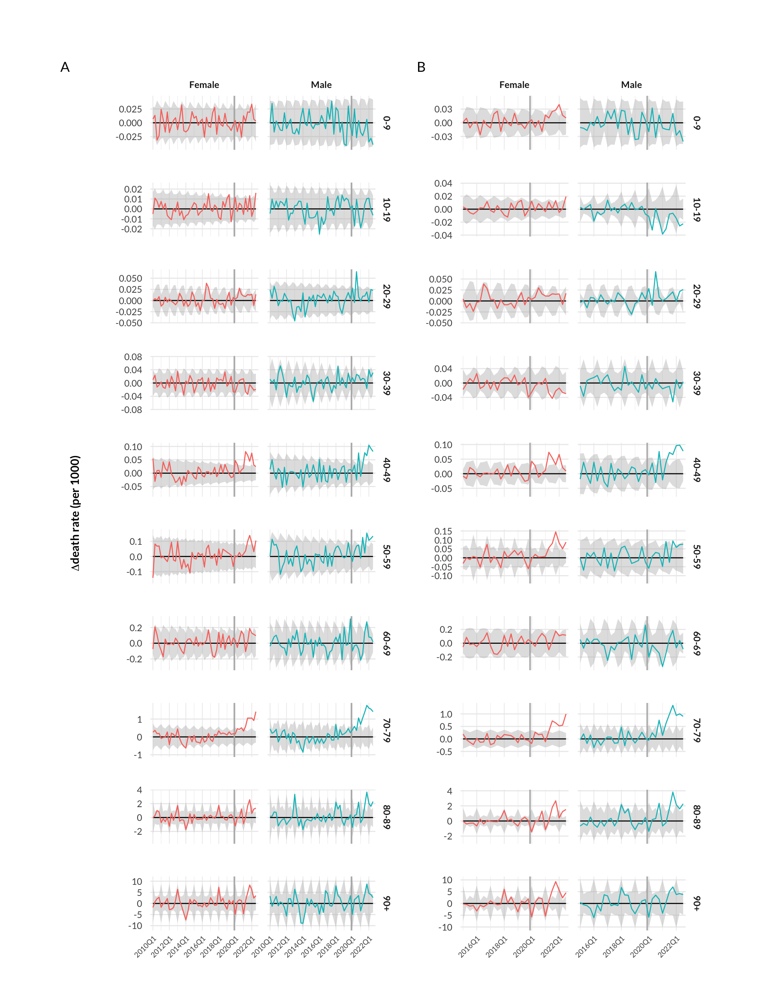
<p class="caption">(\#fig:sab-10y-sex-norm)**De-trended/de-seasonalized quarterly death rates and  baselines.** (A) Baseline reference period 2010-19, and (B) baseline reference period 2015-19. Colored lines indicate the quarterly death rates, black lines indicate the baselines, and the gray bands indicate the 95% prediction intervals. Sex is indicted on top, age on the right.</p>
</div>

</div>


<div class="layout-chunk" data-layout="l-page">
<div class="figure">
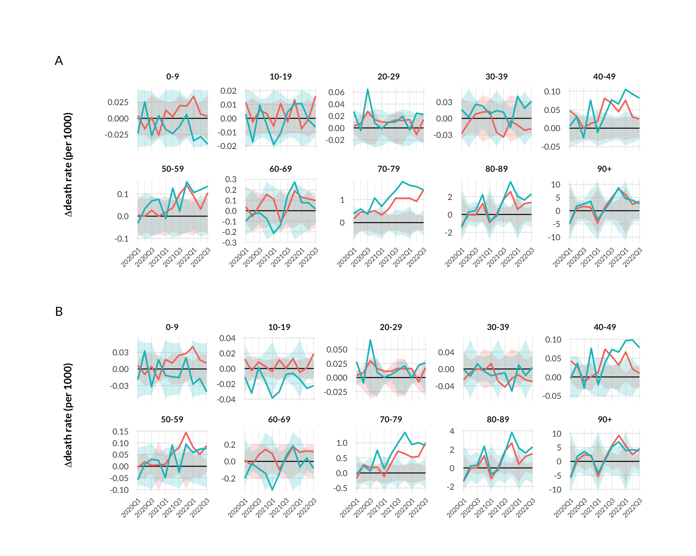
<p class="caption">(\#fig:sab-10y-sex-norm-covid)**De-trended/de-seasonalized quarterly death rates and  baselines for 2020-2022.** (A) Baseline reference period 2010-19, and (B) baseline reference period 2015-19. Colored lines indicate the quarterly death rates for males (blue lines) and females (red lines), black lines indicate the baselines, and the transparent colored bands indicate the 95% prediction intervals for males (blue) and females (red). Sex is indicted on top, age on the right.</p>
</div>

</div>


### Summarizing excess deaths

Here, I define excess deaths as deaths that exceed the season adjusted baseline +/- the prediction interval (thus excess deaths can be both a positive and negative number) for a given  group in a given quarter. It should be kept in mind that the excess death rates resulting from this method depends strongly on, among other things, how the prediction interval is defined (here they are based directly on the observed variation in the baseline period for each quarter-type). Excess deaths are back-calculated from the excess death rates using the age and sex stratified quarterly population numbers. 

Figure \@ref(fig:excess-both-bases-quarter-age) and Table \@ref(tab:excess-table) shows quarterly excess deaths stratified on age,  Figure \@ref(fig:excess-both-bases-quarter-sex) shows quarterly excess deaths stratified on sex, Figure \@ref(fig:excess-both-bases-age-sex) shows excess deaths for the whole period per age group, and Figure  \@ref(fig:excessrate-both-bases-year) shows excess deaths per 100,000 of the entire population per year.


<div class="layout-chunk" data-layout="l-body">


</div>


<div class="layout-chunk" data-layout="l-body-outset">
<div class="figure">
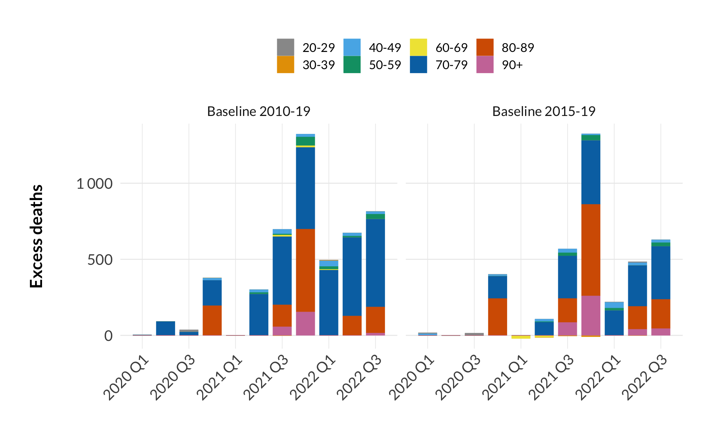
<p class="caption">(\#fig:excess-both-bases-quarter-age)**Excess deaths by age and quarter.** Excess deaths are defined as deaths exceeding the season adjusted baseline +/- the 95% prediction interval in a given quarter. Age groups 0-19 are ommitted.</p>
</div>

</div>


<div class="layout-chunk" data-layout="l-page">

Table: (\#tab:excess-table)Excess deaths for each age group, sex and baseline for the period 2020 Q1 - 2022 Q3. Rounded to whole numbers.

|Age   | Base 2010-19: Female| Base 2010-19: Male| Base 2015-19: Female| Base 2015-19: Male|
|:-----|--------------------:|------------------:|--------------------:|------------------:|
|0-9   |                    3|                  0|                    9|                  1|
|10-19 |                    3|                  0|                    4|                -22|
|20-29 |                    2|                 15|                    3|                 26|
|30-39 |                   -2|                  4|                   -8|                 -9|
|40-49 |                   61|                103|                   57|                 92|
|50-59 |                   45|                 91|                   81|                 19|
|60-69 |                   16|                 11|                    0|                -33|
|70-79 |                 1216|               1841|                  627|               1087|
|80-89 |                  559|                623|                  806|                538|
|90+   |                  211|                 14|                  395|                 34|
|All   |                 2114|               2702|                 1974|               1733|

</div>


<div class="layout-chunk" data-layout="l-body-outset">
<div class="figure">
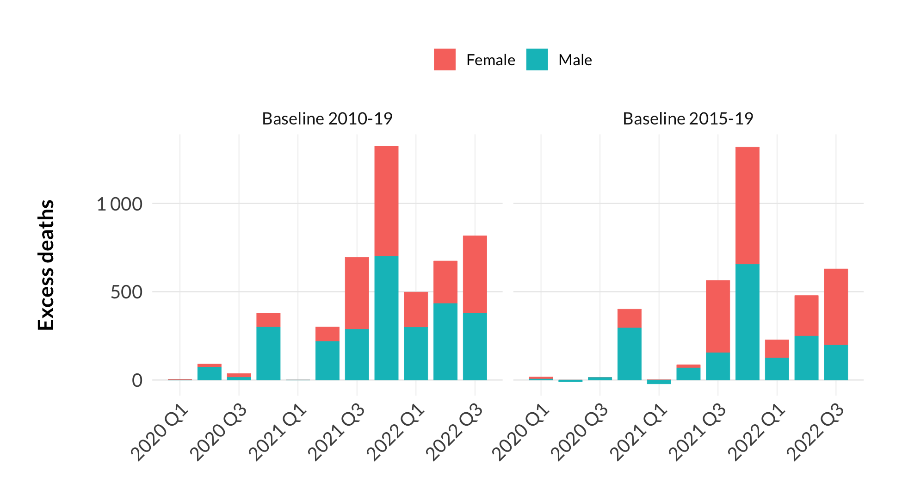
<p class="caption">(\#fig:excess-both-bases-quarter-sex)**Excess deaths by sex and quarter.** Excess deaths are defined as deaths exceeding the season adjusted baseline +/- the 95% prediction interval in a given quarter.</p>
</div>

</div>


<div class="layout-chunk" data-layout="l-body-outset">
<div class="figure">
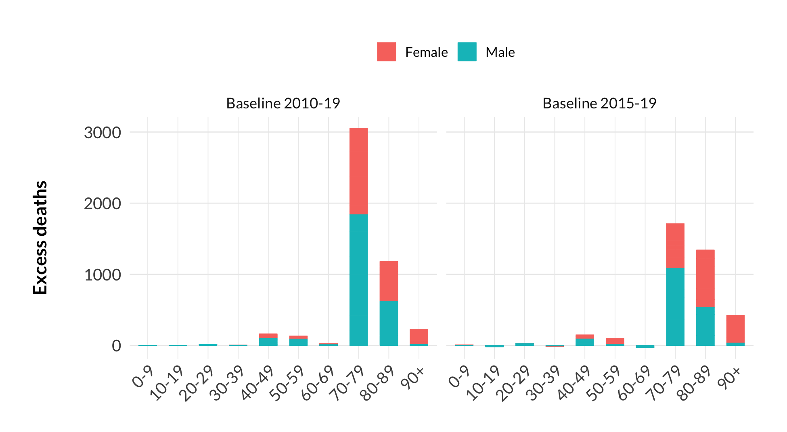
<p class="caption">(\#fig:excess-both-bases-age-sex)**Excess deaths by sex and age.** Excess deaths are defined as deaths exceeding the season adjusted baseline +/- the 95% prediction interval in a given quarter. Total excess deaths over the period 2020 Q1 - 2022 Q3 are summed. </p>
</div>

</div>


<div class="layout-chunk" data-layout="l-body">
<div class="figure">
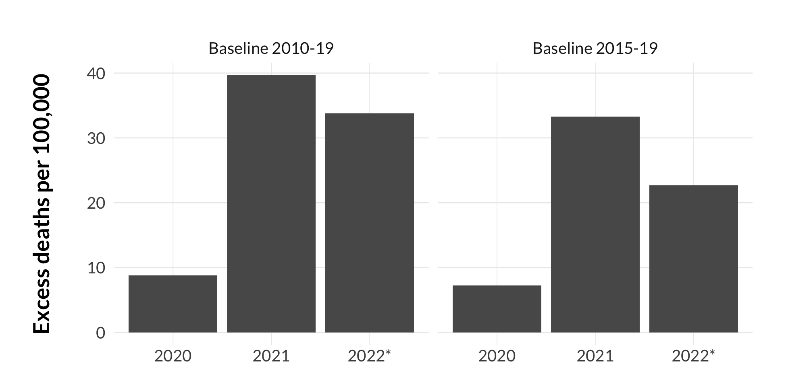
<p class="caption">(\#fig:excessrate-both-bases-year)**Excess deaths per 100,000 of the total Danish population per year.** Excess deaths are defined as deaths exceeding the season adjusted baseline +/- the 95% prediction interval for a given stratification in a given quarter. *) 2022 is calculated based on Q1, Q2, and Q3 only. The population for each year is taken as the mean of the population at the start of each quarter.</p>
</div>

</div>


### Sensitivity to baseline

To explore the sensitivity to choice of baseline, I have calculated the total excess death rate for seven different baselines (Figure \@ref(fig:excessrate-more-bases-10y-sex)).

<div class="layout-chunk" data-layout="l-body">


</div>


<div class="layout-chunk" data-layout="l-body_outset">
<div class="figure">
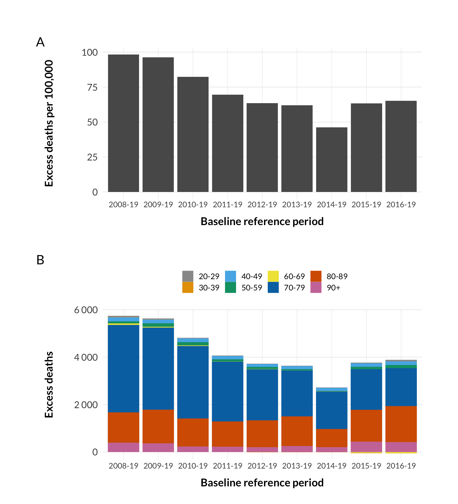
<p class="caption">(\#fig:excessrate-more-bases-10y-sex)**Excess deaths for the period 2020 Q1 - 2022 Q3 depending on baseline reference period.** Excess deaths are defined as deaths exceeding the season adjusted baseline +/- the 95% prediction interval in a given quarter. Baseline period is indicated on the x-axis. (A) Excess deaths per 100,000 of the total Danish population, and (B) excess deaths stratified by age.</p>
</div>

</div>


<div class="layout-chunk" data-layout="l-screen">
<div class="figure">
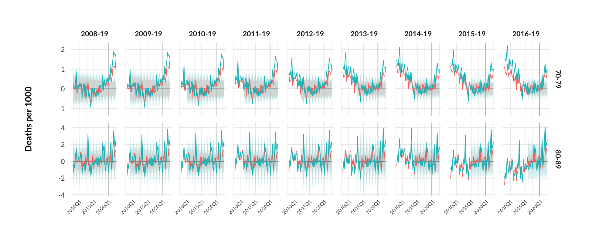
<p class="caption">(\#fig:sab-10y-old-more-base)**De-trended/de-seasonalized death rates and baselines for older age groups using different baseline reference periods.** Colored lines indicate the quarterly death rates for males (blue lines) and females (red lines), black lines indicate the baselines, and the transparent colored bands indicate the 95% prediction intervals for males (blue) and females (red), and the vertical gray line indicates the border between reference period and pandemic period. Age group is indicated on the right. </p>
</div>

</div>


### Sensitivity to stratification


<div class="layout-chunk" data-layout="l-body">


</div>


<div class="layout-chunk" data-layout="l-body">


</div>


<div class="layout-chunk" data-layout="l-page">
<div class="figure">
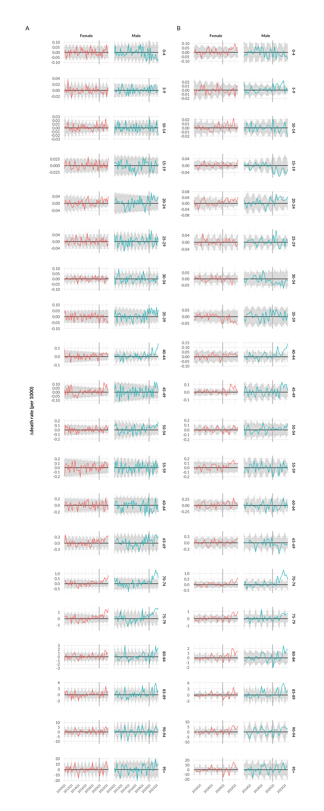
<p class="caption">(\#fig:sab-5y-sex-base2-norm)**De-trended/de-seasonalized quarterly death rates and  baselines using 5-year age brackets.** (A) Baseline reference period 2010-19, and (B) baseline reference period 2015-19. Colored lines indicate the quarterly death rates, black lines indicate the baselines, and the gray bands indicate the 95% prediction intervals. Sex is indicted on top, age on the right.</p>
</div>

</div>


<div class="layout-chunk" data-layout="l-page">
<div class="figure">
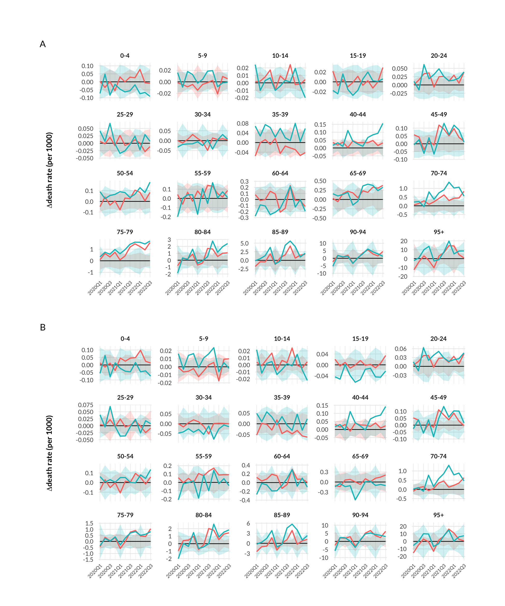
<p class="caption">(\#fig:sab-5y-sex-base2-norm-covid)**De-trended/de-seasonalized quarterly death rates and  baselines for 2020-2022 using 5-year age brackets.** (A) Baseline reference period 2010-19, and (B) baseline reference period 2015-19. Colored lines indicate the quarterly death rates for males (blue lines) and females (red lines), black lines indicate the baselines, and the transparent colored bands indicate the 95% prediction intervals for males (blue) and females (red). Sex is indicted on top, age on the right.</p>
</div>

</div>


<div class="layout-chunk" data-layout="l-body">
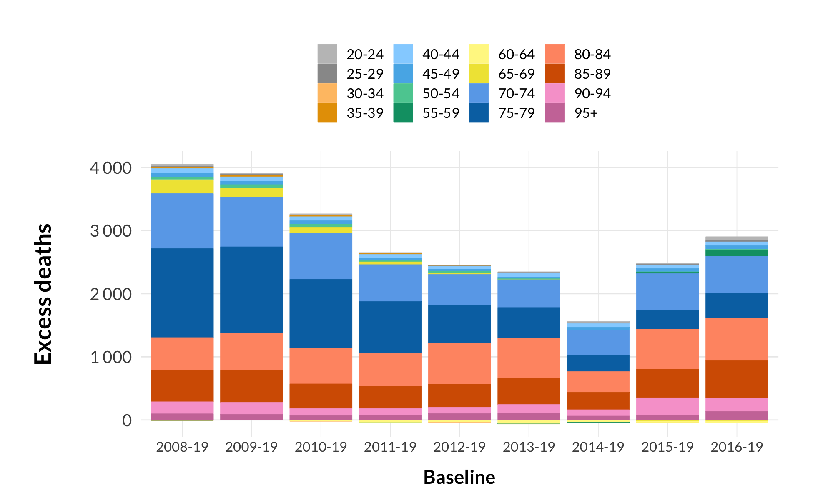<!-- -->

</div>


<div class="layout-chunk" data-layout="l-body">


</div>


<div class="layout-chunk" data-layout="l-body">


</div>


<div class="layout-chunk" data-layout="l-body">


</div>


<div class="layout-chunk" data-layout="l-body_outset">
<div class="figure">
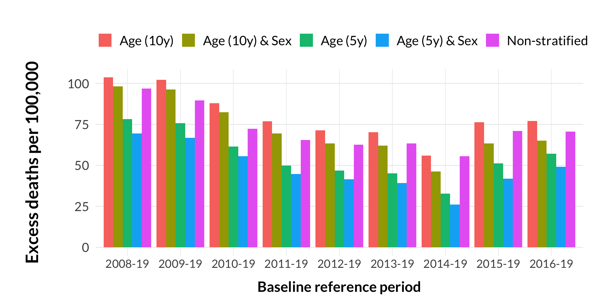
<p class="caption">(\#fig:excessrate-all-preds)**Excess deaths per 100,000 of the total Danish population for the period 2020 Q1 - 2022 Q3 for stratified and non-stratified data depending on baseline reference period.** Excess deaths are defined as deaths exceeding the season adjusted baseline +/- the 95% prediction in a given quarter. Baseline reference period is indicated on the x-axis.</p>
</div>

</div>


<div class="layout-chunk" data-layout="l-body_outset">
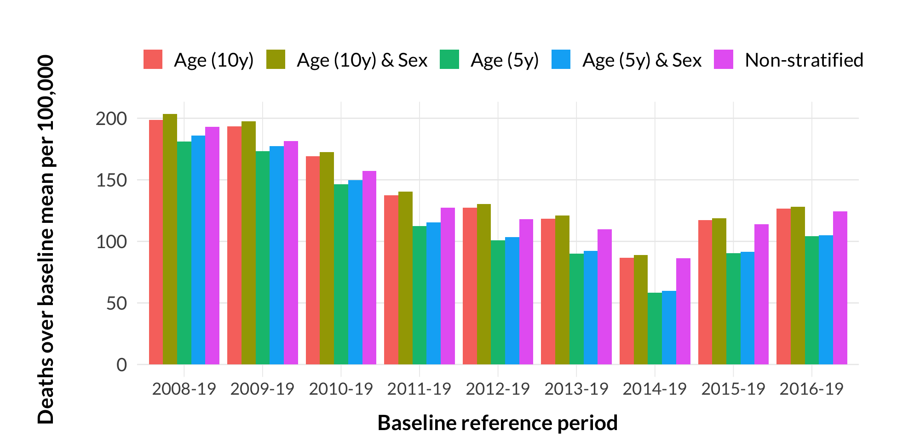<!-- -->

</div>


```{.r .distill-force-highlighting-css}
```
