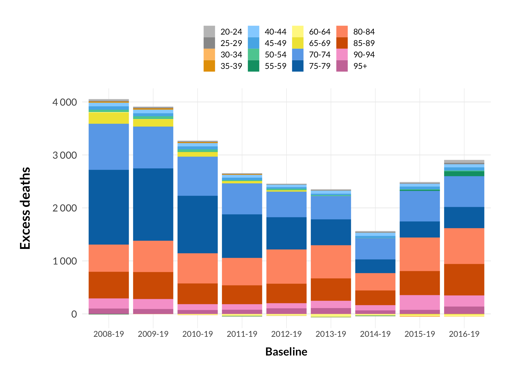
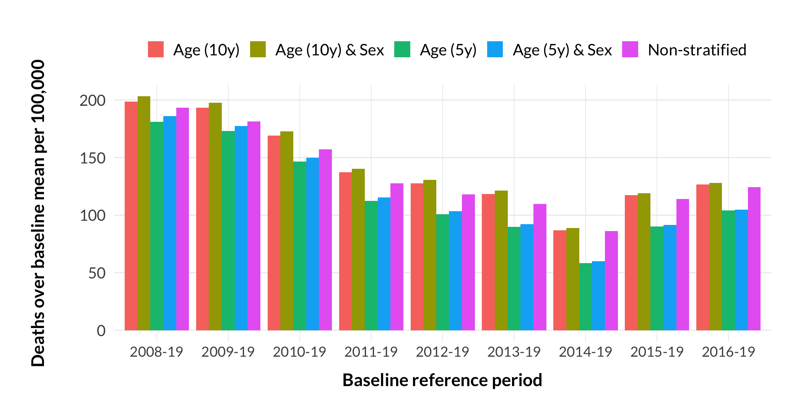

Quarterly age and sex stratified death rates in Denmark from 2020 to
2022
================
true
2022-12-04

## Summary

In this analysis, I calculated age and sex stratified death rates
(deaths per population size) for each quarter during the Covid-19
pandemic in Denmark (2020 Q1 to, so far, 2022 Q3) and compared them to
pre-pandemic death rates using two different baselines. The baselines
were established by linear regression followed by adjustment for
seasonality. Excess deaths were defined as deaths exceeding a prediction
interval (1.96

standard deviation using the chosen baseline period) around the season
adjusted baselines. This analysis therefore takes into account both long
term trends, age composition, and seasonality. With this method, I find
81 and 62 excess deaths per 100,000 (\~4800 and \~3700 excess deaths,
respectively) from 2020 Q1 to 2022 Q3 using the 2010-19 and 2015-19
baseline, respectively. Finally, I explore how sensitive the result is
to choice of baseline (using 2008-19, 2009-19, 2010-19, 2011-19,
2012-19, 2013-19, 2014-19, 2015-19, and 2016-19 baselines) and choice of
data stratification (varying age bin size and sex stratification),
testing 45 combinations in total.

## Methods

### Data

Quarterly age-stratified [population
data](https://www.statistikbanken.dk/FOLK1A) and daily age-stratified
[death data](https://www.statistikbanken.dk/DODC1) were downloaded from
[Danmarks Statistik](https://www.dst.dk/en/) on 23 Nov 2022. The daily
death counts were summed by quarter for each stratification group.

### Death rates

The death rate for a given population group in a given quarter is here
defined as the number of deaths during the quarter divided by the
population size at the start of the quarter.

### Baselines

Baselines were established in two steps. First, I used linear regression
on quarterly death rates for a given baseline period (e.g. 2010-2019) to
establish linear baselines. Then, season adjusted baselines were
calculated using the formulas below. Basically, I calculated the mean
relative deviation
()
from the linear baseline for each quarter-type,

(1, 2, 3, or 4) for the baseline years
(),
and calculated the season adjusted baseline,
,
as the linear baseline value

the product of

and the linear baseline value.

The 95% prediction interval

was calculated as the season adjusted baseline value +/- 1.96

the relative standard deviation for each quarter-type

multiplied by the linear baseline value.


### Excess deaths

Excess death rates were defined as death rates exceeding the season
adjusted baseline +/- the prediction interval.

### Main code

All data manipulations and calculations were performed in R.

``` r
# Main functions ---------------------------------------------------------------
make_death_rates <- function(deaths_df, pop_df, ...) {
  #' Function that calculates death rates
  #' @param deaths_df Data frame with death numbers
  #' @param pop_df Data frame with population numbers
  #' @param ... Stratification variables
  #' @return Data frame 
  pop_df %<>%
    # summarize by quarter and strata
    group_by(..., Year, Quarter) %>%
    summarize(Population = sum(Population, na.rm = TRUE))

  deaths_df %>%
    mutate(
      Year = as.integer(year(Date)),
      Quarter = quarter(Date),
      YQ = zoo::as.yearqtr(format(paste0(Year, Quarter)), "%Y%q")
    ) %>%
    # summarize by quarter and strata
    group_by(..., Year, Quarter, YQ) %>%
    summarize(Deaths = sum(Deaths, na.rm = TRUE)) %>%
    # calculate death rates
    right_join(pop_df, by = c(purrr::map_chr(enquos(...), rlang::as_label), "Year", "Quarter")) %>%
    filter(YQ != "2022 Q4") %>% # excluding current incomplete quarter
    mutate(Death_rate = Deaths / Population) %>%
    ungroup()
}

make_base_df <- function(df, from, to, ...) {
  #' Helper function that makes nested data frame with death rates for the baseline period
  #' @param df Data frame with death rates
  #' @param from Baseline period start year
  #' @param to Baseline period end year
  #' @param ... Stratification variables
  #' @return Nested data frame
  df %>%
    select(..., Year, YQ, Quarter, Death_rate) %>%
    filter(
      Year >= from,
      Year <= to
    ) %>%
    nest(base_data = -c(...))
}

calc_quart_stats <- function(df) {
  #' Helper function that calculates mean, SD, and prediction intervals 
  #' relative to baseline by quarter-type (1,2,3 or 4)
  #' @param df Data frame with death rates and fitted baseline for baseline period
  #' @return Data frame
  df %>%
    group_by(Quarter) %>%
    summarize(
      mean_Q = mean(.resid / .fitted),
      sd_Q = sd(.resid / .fitted),
      conf_lo_Q = mean_Q - 1.96 * sd_Q,
      conf_hi_Q = mean_Q + 1.96 * sd_Q
    )
}

calc_excess <- function(df1, df2) {
  #' Helper function that calculates season adjusted baselines, excess deaths 
  #' and excess death rates
  #' @param df1 Data frame with outputs from calc_quart_stats()
  #' @param df2 Data frame with death rates and fitted baseline for all years
  #' @return Data frame
  df2 %>%
    left_join(df1, by = c("Quarter")) %>%
    # use the relative mean deviation and sd calculated for each quarter type to
    # calculate quarter adjusted fit and prediction interval
    mutate(
      fit = .fitted + mean_Q * .fitted,
      sd = sd_Q * .fitted,
      conf_lo = .fitted + .fitted * conf_lo_Q,
      conf_hi = .fitted + .fitted * conf_hi_Q,
      z = (Death_rate - fit) / sd,
      # calculate excess death rate as death rates exceeding quarterly adjusted fit +/- pred interval
      excess_rate = case_when(
        Death_rate > conf_hi ~ Death_rate - conf_hi,
        Death_rate < conf_lo ~ Death_rate - conf_lo,
        TRUE ~ 0
      ),
      # calculate excess death rate as death rates exceeding either the
      # quarterly adjusted or the linear fit
      excess_rate_sab = Death_rate - fit,
      excess_rate_lb = Death_rate - .fitted,
      # calculate excess deaths as above, but multiplying the rates by population
      excess_abs = excess_rate * Population,
      excess_abs_sab = excess_rate_sab * Population,
      excess_abs_lb = excess_rate_lb * Population
    ) %>%
    select(fit, sd, conf_lo, conf_hi, z, excess_rate, excess_rate_sab, excess_rate_lb, 
           excess_abs, excess_abs_sab, excess_abs_lb)
}

make_prediction <- function(df, pred, from, to, ...) {
  #' Function that calculates baselines and excess deaths
  #' @param df Data frame with death rates
  #' @param pred String with name for the baseline
  #' @param from Baseline period start year
  #' @param to Baseline period end year
  #' @param ... Stratification variables
  #' @return Nested data frame
  df %>%
    select(..., Year, YQ, Quarter, Population, Death_rate) %>%
    mutate(prediction = pred) %>%
    nest(all_data = -c(prediction, ...)) %>% # "all_data" is all data points from 2010-now
    full_join(make_base_df(df, from, to, ...), by = purrr::map_chr(enquos(...), rlang::as_label)) %>%
    mutate(
      # linear regression (= model)
      model = purrr::map(base_data, ~ lm(Death_rate ~ YQ, data = .x)),
      # fit and residuals on all data
      predict = purrr::map2(model, all_data, ~ broom::augment(.x, newdata = .y)),
      # fit and residuals on baseline data only
      predict_base = purrr::map2(model, base_data, ~ broom::augment(.x, newdata = .y)),
      # quarterly SDs and means
      qstats = purrr::map(predict_base, ~ calc_quart_stats(.x)),
      # season adjusted baselines, CI and excess deaths
      excess = purrr::map2(qstats, predict, ~ calc_excess(.x, .y))
    )
}
```

## Results

### Death rates and linear baselines

I calculated death rates for each age and sex group using 10-year bins.
The death rate is here defined as the number of deaths for a given
quarter (Figure @ref(fig:deaths-population)A and B) divided by the
population size at the start of the quarter (Figure
@ref(fig:deaths-population)C).


In order to calculate excess deaths-rates during the Covid-19 pandemic,
a baseline defining the normal death rate must be established against
which the death rates during 2020-22 is compared. I used two different
time periods to establish baselines, a 10-year period from 2010-2019 and
5-year period from 2015-19. To establish baselines, I used linear
regressions.

Figure @ref(fig:linear-baselines-10y-sex) shows the quarterly death
rates for each group from 2010-2022 Q3. First off, note the decreasing
trend in death rates for the age groups 10-89, which is particularly
striking for the middle age groups (40-59). For most age groups, the
2010-19 baseline describes the death-rate trend very well. For the age
group 70-79, however, it looks like the decreasing trend from 2010 to
2019 may be flattening towards the end of the period, highlighting the
importance of baseline choice (as shown in Figure
@ref(fig:excess-both-bases-age-sex) the choice for this age group has a
large impact). For the males in the age-groups 10-19 and 30-39, the two
baselines differ greatly, which may be caused by a combination of large
variation and outliers skewing the 2015-19 baselines. These groups,
however, only contribute little to the overall excess death rate.


### Taking seasonality into account

Deaths in Denmark follow a seasonal pattern, which is primarily caused
by seasonality in the death rates among the older age-groups (which
contributes the majority of deaths in the total population), whereas
deaths among the younger age groups do not exhibit significant
seasonality (Figure @ref(fig:seasonality-10y-sex)).


To better interpret how much the death rates during the pandemic deviate
from the baselines, I established season adjusted baselines and a 95%
prediction interval (calculated as 1.96

standard deviation) based on the quarter-specific variation shown in
Figure @ref(fig:seasonality-10y-sex). The prediction interval thus
reflects the expected variation around the season adjusted baseline
based on the observed pre-pandemic variation. Note, that it is here
assumed that the expected seasonal variation is proportional to the
linear baseline value within each stratification group (the 40-49yo age
group in Figure @ref(fig:sab-10y-sex-norm) exemplifies this). Figures
@ref(fig:sab-10y-sex-base1) and @ref(fig:sab-10y-sex-base2) show the
death rates for each age and sex group together with the season adjusted
baselines.


In the following figures (Figure @ref(fig:sab-10y-sex-norm) and
@ref(fig:sab-10y-sex-norm-covid)), I show the difference between the
observed death rates and the expected season adjusted death rates
(death
rates), effectively de-trending and de-seasonalizing the death rates and
baselines.


### Summarizing excess deaths

Here, I define excess deaths as deaths that exceed the season adjusted
baseline +/- the prediction interval (thus excess deaths can be both a
positive and negative number) for a given group in a given quarter. It
should be kept in mind that the excess death rates resulting from this
method depends strongly on, among other things, how the prediction
interval is defined (here they are based directly on the observed
variation in the baseline period for each quarter-type). Excess deaths
are back-calculated from the excess death rates using the age and sex
stratified quarterly population numbers.

Figure @ref(fig:excess-both-bases-quarter-age) and Table
@ref(tab:excess-table) shows quarterly excess deaths stratified on age,
Figure @ref(fig:excess-both-bases-quarter-sex) shows quarterly excess
deaths stratified on sex, Figure @ref(fig:excess-both-bases-age-sex)
shows excess deaths for the whole period per age group, and Figure
@ref(fig:excessrate-both-bases-year) shows excess deaths per 100,000 of
the entire population per year.


| Age   | Base 2010-19: Female | Base 2010-19: Male | Base 2015-19: Female | Base 2015-19: Male |
|:------|---------------------:|-------------------:|---------------------:|-------------------:|
| 0-9   |                    3 |                  0 |                    9 |                  1 |
| 10-19 |                    3 |                  0 |                    4 |                -22 |
| 20-29 |                    2 |                 15 |                    3 |                 26 |
| 30-39 |                   -2 |                  4 |                   -8 |                 -9 |
| 40-49 |                   61 |                103 |                   57 |                 92 |
| 50-59 |                   45 |                 91 |                   81 |                 19 |
| 60-69 |                   16 |                 11 |                    0 |                -33 |
| 70-79 |                 1216 |               1841 |                  627 |               1087 |
| 80-89 |                  559 |                623 |                  806 |                538 |
| 90+   |                  211 |                 14 |                  395 |                 34 |
| All   |                 2114 |               2702 |                 1974 |               1733 |

Excess deaths for each age group, sex and baseline for the period 2020
Q1 - 2022 Q3. Rounded to whole numbers.


### Sensitivity to baseline

To explore the sensitivity to choice of baseline, I have calculated the
total excess death rate for seven different baselines (Figure
@ref(fig:excessrate-more-bases-10y-sex)).


### Sensitivity to stratification


<!-- -->


<!-- -->
